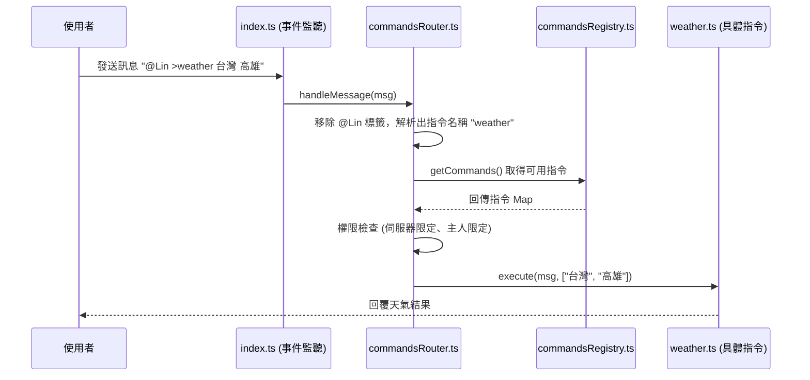
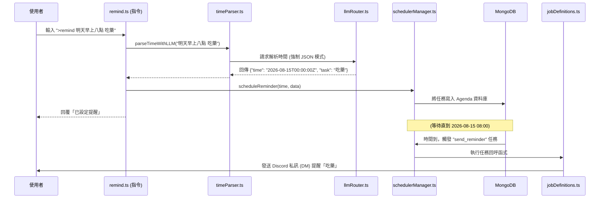
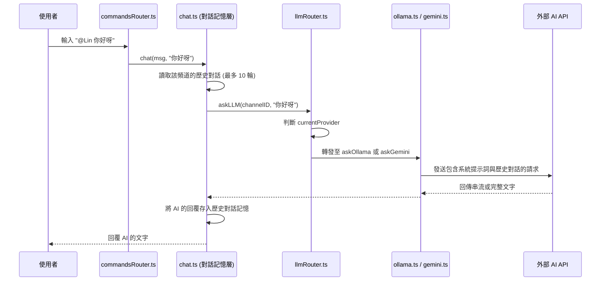
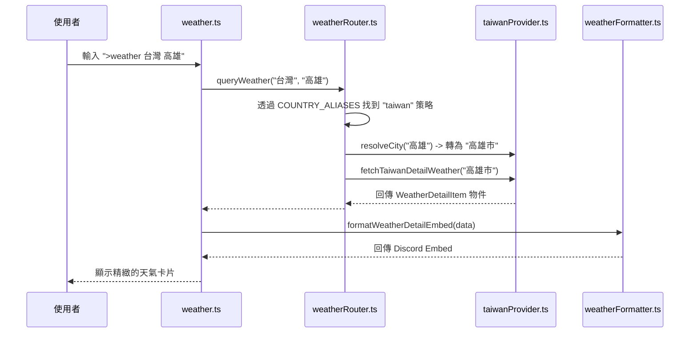

# 🔄 LinBot 核心工作流 (Workflows)

為了讓後續接手的工程師能快速理解系統中各個模組是如何協同運作的，這裡整理了 LinBot 的幾項核心「工作流 (Workflows)」。在這些工作流中，你可以清楚看到不同模組是如何拼裝在一起完成一項具體功能的。

---

## 1. 🎯 指令解析與分發工作流 (Command Routing Flow)

當使用者在頻道中輸入指令（如 `@Lin >weather 台灣 高雄`）時，系統是如何解析並找到對應模組的：

**涉及模組**：
- `src/index.ts`
- `src/commands/commandsRouter.ts`
- `src/commands/commandsRegistry.ts`
- `src/commands/core/weather.ts` (或其他具體指令)

---

## 2. ⏰ 智慧排程提醒工作流 (Scheduler Flow)

當使用者輸入 `@Lin >remind 明天早上八點 記得吃藥` 時，自然語言如何變成系統排程，並在時間到時發送私訊：

**涉及模組**：
- `src/commands/core/remind.ts`
- `src/services/scheduler/timeParser.ts`
- `src/services/scheduler/schedulerManager.ts`
- `src/services/scheduler/jobDefinitions.ts`

---

## 3. 🧠 AI 雙引擎路由工作流 (LLM Router Flow)

當使用者進行一般對話（不加 `>` 前綴）時，系統如何管理記憶並切換 AI 引擎：

**涉及模組**：
- `src/commands/commandsRouter.ts`
- `src/services/LLM/chat.ts`
- `src/services/LLM/llmRouter.ts`
- `src/services/LLM/ollama.ts` & `src/services/LLM/gemini.ts`

---

## 4. 🌤️ 策略模式天氣查詢工作流 (Weather Provider Flow)

查詢天氣時，系統如何透過策略模式將「國家」分發到不同的 Provider：

**涉及模組**：
- `src/commands/core/weather.ts`
- `src/services/weather/weatherRouter.ts`
- `src/services/weather/providers/taiwanProvider.ts`
- `src/services/weather/weatherFormatter.ts`
