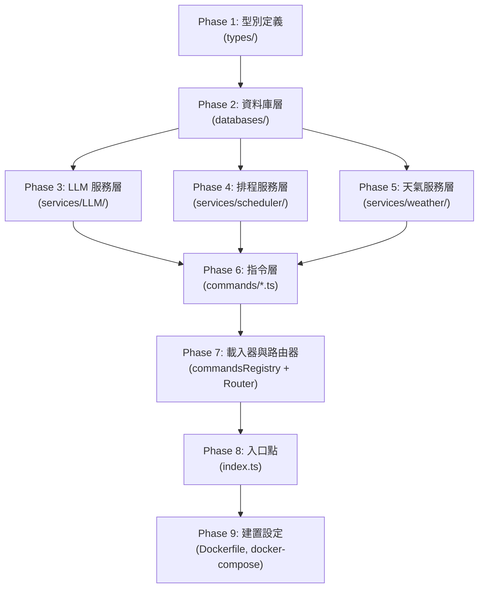

# LinBot TypeScript 遷移計劃書

## 目標

將 LinBot Discord Bot 專案從 JavaScript (ESM) 完整遷移至 TypeScript，建立嚴格的型別系統與統一的編碼規範，提升程式碼品質、可維護性與開發體驗。

---

## 一、TypeScript 環境建置策略

### 1.1 工具鏈選擇

| 工具 | 用途 | 安裝方式 |
|------|------|----------|
| `typescript` | 編譯器 | devDependency |
| `@types/node` | Node.js 型別定義 | devDependency |
| `tsx` | 開發階段即時執行 TS（支援 ESM、零設定） | devDependency |

> [!NOTE]
> `discord.js`、`mongodb`、`@google/genai`、`ollama` 這些套件**本身已內建 `.d.ts` 型別宣告**，不需要另外安裝 `@types/xxx`。
> `agenda` 與 `@agendajs/mongo-backend` 需要確認是否有內建型別宣告，若無則需要手動編寫 `.d.ts`。

### 1.2 `tsconfig.json` 設定

```jsonc
{
  "compilerOptions": {
    // ── 編譯目標 ──
    "target": "ES2022",                    // Node 20 完整支援 ES2022
    "module": "NodeNext",                  // 對應專案原有 "type": "module" (ESM)
    "moduleResolution": "NodeNext",        // ESM 模組解析策略

    // ── 嚴格型別檢查（核心目標）──
    "strict": true,                        // 開啟所有嚴格檢查
    "noUncheckedIndexedAccess": true,      // 陣列/物件索引存取結果自動附加 undefined
    "exactOptionalPropertyTypes": false,   // 先不啟用，避免過度嚴格

    // ── 輸出設定 ──
    "outDir": "./dist",                    // 編譯輸出目錄
    "rootDir": "./src",                    // 原始碼根目錄
    "declaration": true,                   // 產生 .d.ts 宣告檔（便於未來拆模組）
    "sourceMap": true,                     // 產生 source map（方便 debug）

    // ── 相容性 ──
    "esModuleInterop": true,               // 相容 CommonJS 預設匯出
    "skipLibCheck": true,                   // 跳過第三方 .d.ts 檢查（加速編譯）
    "forceConsistentCasingInFileNames": true // 強制檔名大小寫一致
  },
  "include": ["src/**/*"],
  "exclude": ["node_modules", "dist", "scratch", "test"]
}
```

### 1.3 `package.json` 修改

```jsonc
{
  "main": "dist/index.js",               // 進入點改為編譯後的 JS
  "scripts": {
    "build": "tsc",                       // 編譯 TypeScript
    "start": "node dist/index.js",        // 正式環境執行編譯後的 JS
    "dev": "tsx watch src/index.ts",      // 開發環境即時執行（搭配 hot-reload）
    "typecheck": "tsc --noEmit"           // 純型別檢查（不產出檔案）
  },
  "devDependencies": {
    "typescript": "^5.x",
    "@types/node": "^20.x",
    "tsx": "^4.x"
  }
}
```

### 1.4 目錄結構調整

```
LinBot/
├── tsconfig.json                        [NEW]
├── package.json                         [MODIFY]
├── Dockerfile                           [MODIFY]
├── docker-compose.yml                   [MODIFY]
├── .env
├── src/                                 [NEW — 所有原始碼搬入此目錄]
│   ├── index.ts                         ← index.js
│   ├── types/                           [NEW — 集中型別定義]
│   │   ├── command.ts                   [NEW]
│   │   ├── environment.d.ts             [NEW]
│   │   ├── weather.ts                   [NEW]
│   │   ├── scheduler.ts                 [NEW]
│   │   └── llm.ts                       [NEW]
│   ├── commands/
│   │   ├── commandsRegistry.ts          ← commandsRegistry.js
│   │   ├── commandsRouter.ts            ← commandsRouter.js
│   │   ├── Lin.ts                       ← Lin.js
│   │   ├── gif.ts                       ← gif.js
│   │   ├── help.ts                      ← help.js
│   │   ├── remind.ts                    ← remind.js
│   │   ├── restart.ts                   ← restart.js
│   │   ├── switchLLM.ts                 ← switchLLM.js
│   │   ├── userInfo.ts                  ← userInfo.js
│   │   └── weather.ts                   ← weather.js
│   ├── databases/
│   │   └── mongodb.ts                   ← mongodb.js
│   └── services/
│       ├── LLM/
│       │   ├── chat.ts                  ← chat.js
│       │   ├── gemini.ts                ← gemini.js
│       │   ├── llmRouter.ts             ← llmRouter.js
│       │   ├── ollama.ts                ← ollama.js
│       │   └── systemPrompt.ts          ← systemPrompt.js
│       ├── scheduler/
│       │   ├── jobDefinitions.ts        ← jobDefinitions.js
│       │   ├── reminderTemplates.ts     ← reminderTemplates.js
│       │   ├── schedulerManager.ts      ← schedulerManager.js
│       │   └── timeParser.ts            ← timeParser.js
│       └── weather/
│           ├── weatherFormatter.ts      ← weatherFormatter.js
│           ├── weatherRouter.ts         ← weatherRouter.js
│           └── providers/
│               ├── taiwanProvider.ts     ← taiwanProvider.js
│               └── internationalProvider.ts ← (空檔，保留)
├── test/                                [暫不遷移，保留 .js]
│   ├── test-db.js
│   └── test-timeParser.js
├── dist/                                [NEW — tsc 編譯輸出，加入 .gitignore]
└── documents/                           [不變]
```

### 1.5 Dockerfile 更新為多階段建置

```dockerfile
# ── 階段 1：建置（安裝依賴 + TypeScript 編譯）──
FROM node:20-alpine AS builder
WORKDIR /usr/src/app
COPY package*.json ./
RUN npm ci
COPY tsconfig.json ./
COPY src/ ./src/
RUN npx tsc

# ── 階段 2：執行（僅帶入編譯後的 JS + production 依賴）──
FROM node:20-alpine AS runner
ENV NODE_ENV=production
WORKDIR /usr/src/app
COPY package*.json ./
RUN npm ci --omit=dev
COPY --from=builder /usr/src/app/dist ./dist
RUN chown -R node:node /usr/src/app
USER node
CMD ["node", "dist/index.js"]
```

### 1.6 `docker-compose.yml` 開發環境調整

```yaml
services:
  bot:
    # ...
    command: npx tsx watch src/index.ts   # 開發環境改用 tsx watch
    volumes:
      - .:/usr/src/app
      - lin_bot_node_modules:/usr/src/app/node_modules
```

---

## 二、型別系統設計（`src/types/`）

> [!IMPORTANT]
> 這是整份遷移計劃的核心。所有 Interface 都集中在 `src/types/` 目錄下統一管理，供各模組 import 使用。

### 2.1 環境變數型別 — `environment.d.ts`

**目的**：讓 `process.env.XXX` 的存取有型別提示，不再是 `string | undefined`。

```ts
// src/types/environment.d.ts
declare namespace NodeJS {
  interface ProcessEnv {
    // Discord
    BOTTOKEN: string;
    MYUSERID: string;
    CLIENTID?: string;
    GUILDID?: string;

    // Klipy (GIF)
    KLIPYTOKEN: string;

    // Ollama
    OLLAMA_URL: string;
    OLLAMA_MODEL: string;

    // Gemini
    GEMINI_API_KEY: string;
    GEMINI_MODEL: string;

    // LLM Router
    LLM_PROVIDER: string;

    // CWA Weather
    CWA_API_KEY: string;

    // MongoDB
    MONGODB_URI: string;
    MONGODB_DB_NAME: string;
    MONGODB_COLLECTION_REMINDER: string;

    // Timezone
    TIMEZONE?: string;
  }
}
```

### 2.2 指令系統型別 — `command.ts`

**目的**：為 `commandsRegistry` 的動態載入與 `commandsRouter` 的權限檢查提供嚴格的契約。

```ts
// src/types/command.ts
import type { Message } from "discord.js";

/** 指令分類 */
export type CommandCategory = "public" | "moderator" | "owner";

/** 指令定義標準 Schema — 每個指令檔案必須匯出符合此介面的物件 */
export interface BotCommand {
  /** 指令名稱（即 `>xxx` 中的 xxx） */
  name: string;

  /** 指令說明文字，顯示在 >help 選單 */
  description: string;

  /** 分類（決定顯示在 help 的哪一頁） */
  category: CommandCategory;

  /** 是否允許在 DM 私訊中使用（預設 false） */
  dmAllowed: boolean;

  /** 是否僅限主人使用（預設 false） */
  ownerOnly: boolean;

  /** 指令執行函式 */
  execute(msg: Message, args: string[]): Promise<void>;
}
```

### 2.3 排程系統型別 — `scheduler.ts`

**目的**：為 Agenda Job 的 `data` 欄位提供型別保護，避免存取不存在的屬性。

```ts
// src/types/scheduler.ts

/** Agenda 任務附帶資料（存入 MongoDB） */
export interface ReminderJobData {
  userId: string;
  channelId: string;
  content: string;
  createdAt: string;           // ISO 8601 字串
  dmRetryCount?: number;       // 私訊屏蔽重試計數器
}

/** getUserReminders() 回傳的單筆提醒 */
export interface ReminderInfo {
  index: number;
  content: string;
  scheduledAt: Date;
  createdAt: string;
  jobId: unknown;              // MongoDB ObjectId
}

/** cancelReminder() 的回傳結果 */
export interface CancelReminderResult {
  success: boolean;
  message: string;
  content?: string;
}

/** parseTimeWithLLM() 的回傳結果 */
export interface ParsedTimeResult {
  time: string;                // UTC ISO 8601
  task: string;
}
```

### 2.4 天氣系統型別 — `weather.ts`

**目的**：為中央氣象署 API 回應與內部資料流提供嚴格型別。

```ts
// src/types/weather.ts

/** 天氣總覽模式（全台各縣市概要） */
export interface WeatherOverviewItem {
  locationName: string;
  description: string;
  maxTemp: string;
  minTemp: string;
  avgTemp: string;
  temperature: string;         // "minT ~ maxT" 格式
  rainProb: string;
  comfort: string;
}

/** 天氣詳細模式（單一縣市完整報告） */
export interface WeatherDetailItem extends WeatherOverviewItem {
  feelTemp: string;
  humidity: string;
  windSpeed: string;
  windDir: string;
  detail: string;
}

/** queryWeather() 回傳值的聯合型別（透過 isDetailed 區分） */
export type WeatherQueryResult =
  | { weatherList: WeatherOverviewItem[]; isDetailed: false }
  | { weatherList: WeatherDetailItem[];   isDetailed: true  };

/** 天氣 Provider 的標準介面 */
export interface WeatherProvider {
  overview: () => Promise<{ weatherList: WeatherOverviewItem[]; isDetailed: false }>;
  detail:   (cityName: string) => Promise<{ weatherList: WeatherDetailItem[]; isDetailed: true }>;
  resolveCity: (input: string) => string | null;
  displayName: string;
}
```

### 2.5 LLM 系統型別 — `llm.ts`

**目的**：統一 Ollama 與 Gemini 的函式簽章，為 `llmRouter` 的策略模式提供型別保護。

```ts
// src/types/llm.ts

/** 對話式 LLM 函式簽章（帶頻道記憶） */
export type AskLLMFunction = (
  channelId: string,
  userMessage: string
) => Promise<string>;

/** 無狀態完成式 LLM 函式簽章（單次呼叫） */
export type CompleteLLMFunction = (
  systemPrompt: string,
  userMessage: string,
  options?: CompleteLLMOptions
) => Promise<string>;

/** completeLLM 的額外選項 */
export interface CompleteLLMOptions {
  temperature?: number;
  jsonMode?: boolean;
}

/** switchProvider() 的回傳結果 */
export interface SwitchProviderResult {
  success: boolean;
  message: string;
}
```

---

## 三、TypeScript 編碼規範

> [!IMPORTANT]
> 以下規範將作為本專案所有 `.ts` 檔案的統一標準，請在開發時嚴格遵守。

### 3.1 型別標註規則

| 規則 | 說明 | 範例 |
|------|------|------|
| **函式參數必須標註型別** | 禁止依賴隱式推斷 | `function foo(name: string, count: number)` |
| **函式回傳值必須標註型別** | 即使 TS 能推斷也要明確寫出 | `async function bar(): Promise<string>` |
| **禁止使用 `any`** | 真的需要時使用 `unknown` + type narrowing | ❌ `let x: any` → ✅ `let x: unknown` |
| **優先使用 `interface`** | 僅在聯合型別、mapped type 等場景使用 `type` | `interface User { ... }` |
| **使用 `readonly` 保護不變資料** | 常數陣列、設定物件加上 `as const` 或 `readonly` | `const CITIES = [...] as const` |

### 3.2 命名規範

| 項目 | 風格 | 範例 |
|------|------|------|
| 變數 / 函式 | `camelCase` | `getUserReminders()`, `currentProvider` |
| 常數 | `UPPER_SNAKE_CASE` | `MAX_HISTORY`, `DM_BLOCKED_MAX_RETRIES` |
| Interface / Type | `PascalCase` | `BotCommand`, `ReminderJobData` |
| Enum | `PascalCase`（成員也是） | `enum Provider { Ollama, Gemini }` |
| 檔案名稱 | `camelCase.ts`（維持現有慣例） | `commandsRouter.ts`, `llmRouter.ts` |
| 型別定義檔 | `camelCase.ts` 或 `lowercase.d.ts` | `command.ts`, `environment.d.ts` |

### 3.3 Import / Export 規則

```ts
// ✅ 正確：使用 import type 引入純型別（不會被編譯到 JS）
import type { BotCommand } from "../types/command.js";
import type { Message } from "discord.js";

// ✅ 正確：值與型別混合使用時，分開引入
import { Client } from "discord.js";
import type { Message } from "discord.js";

// ✅ 正確：ESM 模組的 import 路徑必須帶 .js 副檔名
//         （即使原始碼是 .ts，編譯後輸出的是 .js）
import { getCommands } from "./commandsRegistry.js";

// ❌ 錯誤：不要省略副檔名
import { getCommands } from "./commandsRegistry";

// ❌ 錯誤：不要使用 .ts 副檔名
import { getCommands } from "./commandsRegistry.ts";
```

> [!WARNING]
> **ESM + TypeScript 的 Import 路徑必須寫 `.js`**。這是因為 `tsc` 編譯時**不會改寫 import路徑**，所以必須寫成最終在 `dist/` 目錄中的檔名（即 `.js`）。這是 NodeNext 模組解析策略下的官方規範。

### 3.4 Error Handling 規則

```ts
// ✅ 正確：catch 區塊使用型別窄化
try {
  await someOperation();
} catch (error: unknown) {
  // 使用 instanceof 做 type narrowing
  if (error instanceof Error) {
    console.error("❌ 錯誤：", error.message);
  }
}

// ❌ 錯誤：直接假設 error 有 .message 屬性
catch (error) {
  console.error(error.message);  // TS strict 模式下會報錯
}
```

### 3.5 Null Safety 規則

```ts
// ✅ 正確：使用 optional chaining + nullish coalescing
const username = client.user?.username ?? "Unknown";

// ✅ 正確：使用 type guard 做安全存取
const cmd = commands.get(commandName);
if (!cmd) return;  // 之後 cmd 的型別自動縮窄為 BotCommand

// ❌ 錯誤：不做 null check 直接存取
const username = client.user.username;  // client.user 可能是 null
```

---

## 四、各檔案轉換策略（依層級分 Phase 遷移）

### Phase 1：基礎設施層（無外部依賴，影響範圍小）

#### [NEW] `src/types/environment.d.ts`
- 宣告 `ProcessEnv` 擴充，讓所有 `process.env.XXX` 有型別提示

#### [NEW] `src/types/command.ts`
- 定義 `BotCommand` 介面與 `CommandCategory` 型別

#### [NEW] `src/types/scheduler.ts`
- 定義 `ReminderJobData`、`ReminderInfo`、`CancelReminderResult`、`ParsedTimeResult`

#### [NEW] `src/types/weather.ts`
- 定義 `WeatherOverviewItem`、`WeatherDetailItem`、`WeatherQueryResult`、`WeatherProvider`

#### [NEW] `src/types/llm.ts`
- 定義 `AskLLMFunction`、`CompleteLLMFunction`、`CompleteLLMOptions`、`SwitchProviderResult`

---

### Phase 2：資料庫層

#### [MODIFY] `databases/mongodb.js` → `src/databases/mongodb.ts`

**轉換重點**：
- 模組級變數 `client` 和 `db` 補上 `MongoClient | null` 和 `Db | null` 型別
- `getMongoConnection()` 回傳值標註為 `Promise<{ client: MongoClient; db: Db }>`
- `dbName` 參數標註型別：`dbName: string = process.env.MONGODB_DB_NAME`

---

### Phase 3：服務層 — LLM

#### [MODIFY] `services/LLM/systemPrompt.js` → `src/services/LLM/systemPrompt.ts`
- 最簡單的檔案，只需確保 `SYSTEM_PROMPT` 是 `string` 常數

#### [MODIFY] `services/LLM/ollama.js` → `src/services/LLM/ollama.ts`

**轉換重點**：
- `conversationHistory` 標註為 `Map<string, OllamaMessage[]>`
- 定義 Ollama 訊息的型別（`role: "user" | "assistant" | "system"`）
- `askOllama` 和 `completeOllama` 標註符合 `AskLLMFunction` / `CompleteLLMFunction` 簽章
- fix bug: `conversationHistory.has(channelID, [])` → `.has(channelID)` (Map.has 只接受一個參數)

#### [MODIFY] `services/LLM/gemini.js` → `src/services/LLM/gemini.ts`

**轉換重點**：
- `conversationHistory` 標註為 `Map<string, GeminiMessage[]>`
- 定義 Gemini 訊息的型別（`role: "user" | "model"`）
- `completeGemini` 的 `options` 參數使用 `CompleteLLMOptions` 介面

#### [MODIFY] `services/LLM/llmRouter.js` → `src/services/LLM/llmRouter.ts`

**轉換重點**：
- `providers` 對照表標註為 `Record<string, AskLLMFunction>`
- `completionProviders` 標註為 `Record<string, CompleteLLMFunction>`
- `switchProvider()` 回傳值使用 `SwitchProviderResult` 介面

#### [MODIFY] `services/LLM/chat.js` → `src/services/LLM/chat.ts`

**轉換重點**：
- `msg` 參數標註為 `Message`
- `userText` 標註為 `string`

---

### Phase 4：服務層 — Scheduler

#### [MODIFY] `services/scheduler/timeParser.js` → `src/services/scheduler/timeParser.ts`

**轉換重點**：
- `getCurrentFormattedTime()` 回傳值標註 `string`
- `parseTimeWithLLM()` 回傳值標註 `Promise<ParsedTimeResult | null>`
- `getVal` 輔助函式的 type assertion 處理（`parts.find()` 可能回傳 `undefined`）

#### [MODIFY] `services/scheduler/reminderTemplates.js` → `src/services/scheduler/reminderTemplates.ts`

**轉換重點**：
- 所有函式參數補上型別標註
- `formatReminderListEmbed` 的 `reminders` 參數使用 `ReminderInfo[]`
- `formatCancelMessage` 的 `result` 參數使用 `CancelReminderResult`

#### [MODIFY] `services/scheduler/schedulerManager.js` → `src/services/scheduler/schedulerManager.ts`

**轉換重點**：
- `agenda` 標註為 `Agenda | null`
- `initScheduler()` 的 `client` 參數標註為 `Client`
- `scheduleReminder()` 的 `data` 參數使用 `ReminderJobData`
- `getUserReminders()` 回傳值標註 `Promise<ReminderInfo[]>`
- `cancelReminder()` 回傳值標註 `Promise<CancelReminderResult>`

#### [MODIFY] `services/scheduler/jobDefinitions.js` → `src/services/scheduler/jobDefinitions.ts`

**轉換重點**：
- `job.attrs.data` 透過泛型或 type assertion 標註為 `ReminderJobData`
- Discord API error code `50007` 需要適當的型別窄化（`error` 是 `DiscordAPIError`）
- `defineAllJobs` 的參數使用 `Agenda` 和 `Client` 型別

---

### Phase 5：服務層 — Weather

#### [MODIFY] `services/weather/providers/taiwanProvider.js` → `src/services/weather/providers/taiwanProvider.ts`

**轉換重點**：
- `getOverviewValue()` 和 `getDetailValue()` 的 `location` 參數需要定義 CWA API 回應結構
- 建議採用 **寬鬆型別策略**：先用 `Record<string, any>` 做最外層，關鍵存取路徑做型別窄化
- `fetchTaiwanWeather()` 回傳值標註使用 `WeatherQueryResult`

> [!NOTE]
> **CWA API 回應型別策略**：中央氣象署 API 的回應 JSON 巢狀層級深達 6 層以上，且不同 endpoint 結構差異大。建議**不要**試圖定義完整的 API Response Interface，而是：
> 1. 最外層 `fetch` 結果用 `unknown`，搭配 `as` assertion 轉為簡易介面
> 2. 專注定義我們實際存取的欄位路徑

#### [MODIFY] `services/weather/weatherFormatter.js` → `src/services/weather/weatherFormatter.ts`

**轉換重點**：
- `formatWeatherOverviewEmbed()` 參數標註 `WeatherOverviewItem[]`，回傳 `EmbedBuilder[]`
- `formatWeatherDetailEmbed()` 參數標註 `WeatherDetailItem`（注意：原始碼中此函式實際接收的是整個 `weatherData` 物件而非陣列，需要調整）

#### [MODIFY] `services/weather/weatherRouter.js` → `src/services/weather/weatherRouter.ts`

**轉換重點**：
- `COUNTRY_ALIASES` 標註為 `Record<string, string>`
- `TAIWAN_CITIES` 使用 `as const` 讓型別更精確
- `providers` 對照表標註為 `Record<string, WeatherProvider>`
- `queryWeather()` 回傳值標註 `Promise<WeatherQueryResult>`

---

### Phase 6：指令層

> [!IMPORTANT]
> 所有指令檔案都必須匯出一個符合 `BotCommand` 介面的物件。這是 TypeScript 遷移帶來的最大收益之一——任何新增或修改的指令，若缺少必要欄位或型別不符，編譯器會立即報錯。

#### 通用模式（適用所有指令檔案）：

```ts
import type { BotCommand } from "../types/command.js";

export const commandName: BotCommand = {
  name: "xxx",
  description: "...",
  category: "public",
  dmAllowed: false,
  ownerOnly: false,

  async execute(msg, args): Promise<void> {
    // msg 和 args 的型別會從 BotCommand 介面自動推斷
  },
};
```

#### 各指令特別注意事項：

| 指令檔案 | 特殊轉換需求 |
|----------|-------------|
| `Lin.ts` | 最簡單，無特殊處理 |
| `gif.ts` | `fetch` 回傳的 GIF API JSON 需要簡單型別定義或 `unknown` + assertion |
| `help.ts` | `CATEGORY_CONFIG` 使用 `Record<CommandCategory, CategoryConfig>` 約束；`cmdsByCategory` 使用 `Record<CommandCategory, BotCommand[]>` |
| `remind.ts` | 使用 `ParsedTimeResult` 與 `ReminderJobData` 型別 |
| `restart.ts` | 最簡單，無特殊處理 |
| `switchLLM.ts` | `switchProvider` 回傳值已有 `SwitchProviderResult` 型別 |
| `userInfo.ts` | `msg.mentions.members?.first()` 需要 null check（TS 會強制要求） |
| `weather.ts` | 使用 `WeatherQueryResult` 的 discriminated union（透過 `isDetailed` 區分） |

---

### Phase 7：指令載入器與路由器

#### [MODIFY] `commands/commandsRegistry.js` → `src/commands/commandsRegistry.ts`

**轉換重點（重要）**：
- `commands` 標註為 `Map<string, BotCommand>`
- `EXCLUDED_FILES` 副檔名從 `.js` 改為 `.ts`（或改為動態偵測）
- 動態 `import()` 後需要做 type assertion：
  ```ts
  const module = await import(`./${file}`) as Record<string, unknown>;
  // 對每個 export 值做 type guard 檢查是否符合 BotCommand
  ```
- `loadCommands()` 回傳 `Promise<Map<string, BotCommand>>`

> [!WARNING]
> **動態載入的副檔名問題**：`fs.readdirSync` 掃描 `dist/commands/` 時，檔案副檔名是 `.js`。但在開發模式下使用 `tsx` 直接執行 `.ts` 時，目錄中的副檔名是 `.ts`。
> 
> **解決方案**：改為過濾 `.js` 和 `.ts` 雙副檔名，或者改用靜態指令註冊（手動 import 每個指令）。建議採用後者，因為靜態 import 能獲得完整的型別檢查。

#### [MODIFY] `commands/commandsRouter.js` → `src/commands/commandsRouter.ts`

**轉換重點**：
- `handleMessage(msg: Message): Promise<void>`
- `commands` 標註為 `Map<string, BotCommand>`
- `command` 變數從 `string | undefined` 需要做 null check
- `error` catch 區塊使用 `unknown` + type narrowing

---

### Phase 8：入口點

#### [MODIFY] `index.js` → `src/index.ts`

**轉換重點**：
- `client.user` 可能為 `null`，需要 null assertion 或 guard：
  ```ts
  client.once("ready", async () => {
    console.log(`✅ 機器人 ${client.user!.username} 已上線！`);
    // 或更安全的寫法：
    if (!client.user) throw new Error("Client user is null");
    console.log(`✅ 機器人 ${client.user.username} 已上線！`);
  });
  ```
- `error` catch 區塊按照規範處理

---

### Phase 9：建置設定檔

#### [MODIFY] `Dockerfile`
- 改為多階段建置（見 1.5 節）

#### [MODIFY] `docker-compose.yml`
- 開發模式命令改為 `npx tsx watch src/index.ts`

#### [MODIFY] `.gitignore`
- 新增 `dist/` 目錄

#### [MODIFY] `.dockerignore`
- 新增 `dist/`、`src/` 排除（Docker build 會自行編譯）

---

## 五、遷移執行順序與原則

### 執行策略：**由內而外、逐步推進**



### 遷移守則

1. **每完成一個 Phase 就執行 `npx tsc --noEmit` 確認零編譯錯誤**
2. **每個 Phase 完成後，進行人工測試確認功能正常**
3. **不改變任何業務邏輯**——此次遷移純粹是「加上型別」，不修改程式行為
4. **保留所有原有註解**——中文註解是專案的重要文件資產

---

## 六、驗證計劃

### 自動化檢查
- `npx tsc --noEmit`：零 TypeScript 編譯錯誤
- `npm run build`：成功編譯至 `dist/`，無任何警告

### 手動功能測試
- `!help` → 幫助選單正常顯示，按鈕翻頁正常
- `!gif` → GIF 搜尋與傳送正常
- `!weather 台灣` → 天氣總覽正常顯示
- `!weather 台灣 高雄` → 詳細天氣正常顯示
- `!remind 三小時後 測試` → 排程設定成功
- `!remind list` → 提醒列表正常
- `!remind cancel 1` → 取消提醒正常
- `!switchLLM gemini` → LLM 切換正常
- 非指令文字 → LLM 對話正常回覆

### Docker 驗證
- `docker compose build` → 多階段建置成功
- `docker compose up` → 機器人正常上線

---

## Open Questions

> [!IMPORTANT]
> **指令載入器要不要改成靜態 import？**
> 
> 目前 `commandsRegistry.js` 使用 `fs.readdirSync` 動態掃描指令檔案。改為 TypeScript 後有兩種選擇：
> 
> - **方案 A（保留動態載入）**：維持現有彈性（新增指令只需加檔案），但 import 後需要額外做 runtime type guard 驗證。
> - **方案 B（改為靜態 import）**：獲得完整編譯期型別檢查，但新增指令時需手動在 Registry 加一行 import。
> 
> 建議採用方案 A（保留動態），因為目前的架構已經運作良好，且新增指令的便利性是這個設計的核心價值。只需在動態載入後加上 type guard 驗證即可。

> [!IMPORTANT]
> **`test/` 目錄是否一同遷移？**
> 
> 目前 `test/` 下只有 2 個簡單測試腳本。建議**暫不遷移**，保留 `.js` 格式。等主體遷移完成後再視需求決定。

> [!IMPORTANT]
> **`agenda` 套件的型別支援度？**
> 
> `agenda@6.x` 與 `@agendajs/mongo-backend@4.x` 的 TypeScript 型別宣告需要實際安裝後確認。若缺少型別，可能需要手動編寫 `agenda.d.ts` 或使用 `// @ts-ignore` 暫時繞過。
