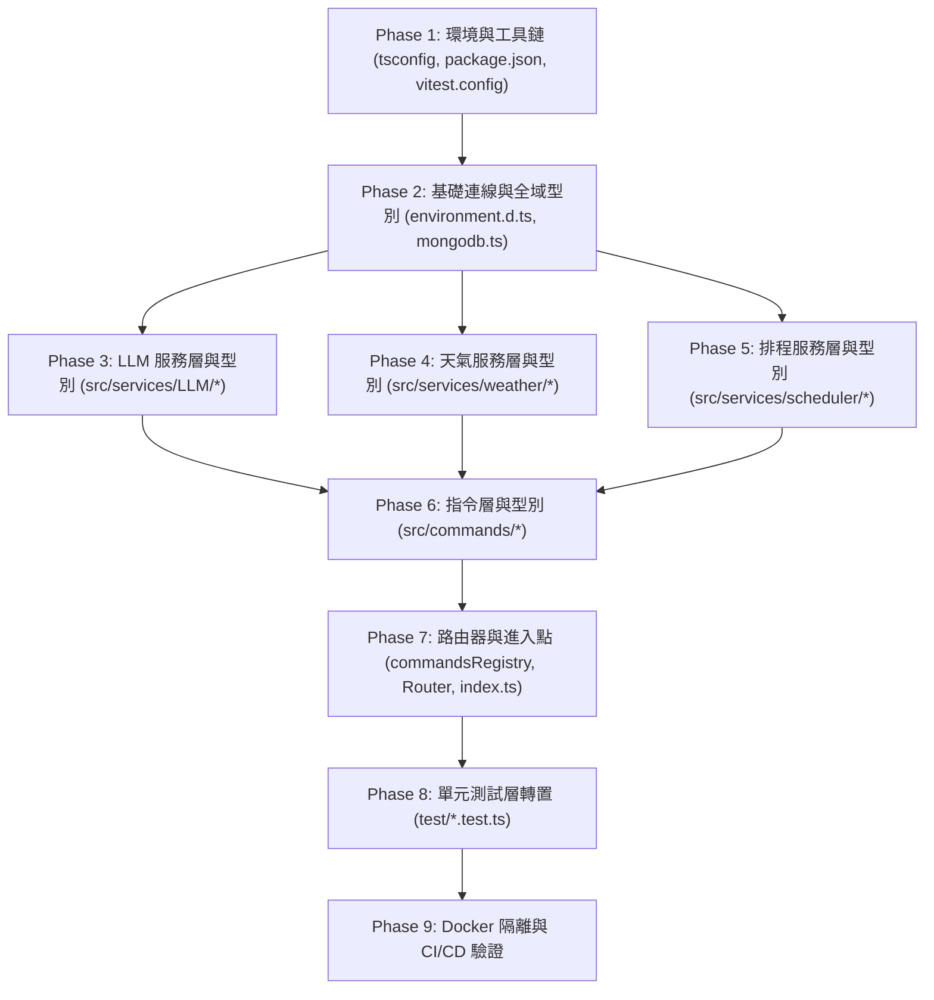

# LinBot TypeScript 遷移計劃書 (v2.1 完整架構版)

> **版本變更說明 (v2.1)**：
> 1. **保留 `src/` 目錄隔離**：將所有機器人運作程式碼收納於 `src/` 下，與根目錄的各項設定檔（Config Files）明確分離。
> 2. **完整列出所有設定檔**：補全目錄樹中未被修改但依然必要的設定檔（`.env`、`.gitignore`、`.dockerignore`、`.npmrc`、`.node-version` 等）。
> 3. **就近型別宣告 (Co-located Types)**：將型別定義檔就近擺放在各自模組內（如 `src/services/weather/weatherTypes.ts`），提升開發時的內聚性與維護性。

---

## 零、可執行性評估報告 (Feasibility Assessment)

### 0.1 可行性綜合評定：**高（High）**
專案模組職責清晰，已完成環境隔離與測試框架建置。保留 `src/` 能讓根目錄設定檔與機器人原始碼層級分明。

### 0.2 最新架構變更之影響與對策評估

| 專案現況與需求 | 對 TS 遷移計劃之影響 | 應對方案 |
|-------------|-------------------|---------|
| **`src/` 原始碼隔離** | 乾淨分隔設定檔與程式碼 | 原始碼統一放在 `src/`，編譯輸出至 `dist/`，根目錄專門存放配置與設定檔。 |
| **Node.js 22 (`.node-version`)** | 支援更現代的 JS/TS 特性 | `tsconfig.json` 設定 `target: "ES2022"`，Dockerfile 基底統一定為 `node:22-alpine`。 |
| **精確版本鎖定 (`.npmrc`)** | `save-exact=true` 禁用 `^` / `~` | 所有 TS 工具鏈安裝指令必須寫明精確版本號。 |
| **Vitest 測試套件 (`vitest`)** | `test/` 原原生支援 TypeScript | 將 `test/` 納入遷移標的，改寫為 `.test.ts` 能同時驗證型別與邏輯。 |
| **Agenda v6 API 重構** | v6 使用 `job.data` 與 `job.nextRunAt` | 型別定義對齊 Agenda v6 泛型 API (`src/services/scheduler/schedulerTypes.ts`)。 |
| **3 階段 Dockerfile 隔離** | 開發/生產環境完全獨立 | 開發階段用 `npx tsx watch src/index.ts`，生產階段用 `tsc` 編譯至 `dist/`。 |

---

## 一、TypeScript 環境建置與目錄架構

### 1.1 工具鏈選擇與版本鎖定 (符合 `.npmrc`)

依據專案 `.npmrc` 規範（`save-exact=true`），工具鏈須精確指定版本號：

```bash
npm install --save-dev typescript@5.7.3 @types/node@22.10.10 tsx@4.19.2
```

### 1.2 `tsconfig.json` 設定

在專案根目錄建立 `tsconfig.json`：

```jsonc
{
  "compilerOptions": {
    // ── 編譯目標 (對齊 Node 22) ──
    "target": "ES2022",
    "module": "NodeNext",
    "moduleResolution": "NodeNext",

    // ── 嚴格型別檢查 ──
    "strict": true,
    "noUncheckedIndexedAccess": true,
    "exactOptionalPropertyTypes": false,

    // ── 輸出與根目錄設定 ──
    "outDir": "./dist",
    "rootDir": "./src",
    "declaration": true,
    "sourceMap": true,

    // ── 模組相容性 ──
    "esModuleInterop": true,
    "skipLibCheck": true,
    "forceConsistentCasingInFileNames": true
  },
  "include": ["src/**/*"],
  "exclude": ["node_modules", "dist", "scratch"]
}
```

### 1.3 `package.json` 整合修改

```jsonc
{
  "main": "dist/index.js",
  "scripts": {
    "dev": "npx tsx watch src/index.ts",
    "build": "tsc",
    "start": "node dist/index.js",
    "typecheck": "tsc --noEmit",
    "test": "vitest run",
    "test:watch": "vitest",
    "test:coverage": "vitest run --coverage"
  },
  "devDependencies": {
    "mongodb-memory-server": "10.0.0",
    "nodemon": "3.1.0",
    "typescript": "5.7.3",
    "@types/node": "22.10.10",
    "tsx": "4.19.2",
    "vitest": "3.2.0"
  }
}
```

### 1.4 完整目錄結構規劃 (含全域設定檔與就近型別)

```
LinBot/
├── .env                                 (保留 — 環境變數檔)
├── .gitignore                           [MODIFY — 加入 dist/、coverage/ 等]
├── .dockerignore                        (保留 — Docker 忽略檔)
├── .npmrc                               (保留 — 專案級 npm 規範檔)
├── .node-version                        (保留 — Node.js 22 版本鎖定檔)
├── package.json                         [MODIFY — 增加 TS 依賴與腳本]
├── package-lock.json                    (npm lock 檔)
├── tsconfig.json                        [NEW — TypeScript 設定檔]
├── vitest.config.ts                     [NEW — Vitest 測試設定檔]
├── Dockerfile                           [MODIFY — TS 3階段建置]
├── docker-compose.yml                   [MODIFY — 改跑 src/index.ts]
│
├── src/                                 [NEW — 機器人程式碼統一收納目錄]
│   ├── index.ts                         ← index.js
│   ├── types/                           [NEW — 僅收納全域系統級型別]
│   │   └── environment.d.ts             (process.env 型別宣告)
│   ├── commands/                        (指令層)
│   │   ├── commandTypes.ts              [NEW — 指令 Schema 介面]
│   │   ├── commandsRegistry.ts
│   │   ├── commandsRouter.ts
│   │   └── ... (各指令模組 .ts)
│   ├── databases/                       (資料庫連線層)
│   │   └── mongodb.ts
│   └── services/                        (服務層)
│       ├── LLM/
│       │   ├── llmTypes.ts              [NEW — LLM 介面與回應型別]
│       │   └── ... (.ts)
│       ├── scheduler/
│       │   ├── schedulerTypes.ts        [NEW — 排程與 Agenda v6 型別]
│       │   └── ... (.ts)
│       └── weather/
│           ├── weatherTypes.ts          [NEW — 天氣 API Payload 型別]
│           └── ... (.ts)
│
├── test/                                [MODIFY — 單元測試層]
│   ├── mongodb.test.ts                  ← test-db.js
│   └── timeParser.test.ts               ← test-timeParser.js
│
├── dist/                                [NEW — tsc 編譯自動產出，不進版控]
├── documents/                           (說明文件區)
├── implements/                          (實作計畫區)
└── scratch/                             (草稿測試區)
```

### 1.5 Dockerfile 3 階段 TS 隔離建置

```dockerfile
# ════════════════════════════════════════════
# 階段 1：共用基礎層 (Node.js 22)
# ════════════════════════════════════════════
FROM node:22-alpine AS base
WORKDIR /usr/src/app
COPY package*.json tsconfig.json ./

# ════════════════════════════════════════════
# 階段 2：開發環境 (使用 tsx watch + devDependencies)
# ════════════════════════════════════════════
FROM base AS development
ENV NODE_ENV=development
RUN npm install
COPY . .
RUN chown -R node:node /usr/src/app
USER node
CMD ["npx", "tsx", "watch", "src/index.ts"]

# ════════════════════════════════════════════
# 階段 3：生產環境 (tsc 編譯 + 僅 dependencies)
# ════════════════════════════════════════════
FROM base AS builder
RUN npm install
COPY src/ ./src/
RUN npx tsc

FROM node:22-alpine AS production
ENV NODE_ENV=production
WORKDIR /usr/src/app
COPY package*.json ./
RUN npm install --omit=dev
COPY --from=builder /usr/src/app/dist ./dist
RUN chown -R node:node /usr/src/app
USER node
CMD ["node", "dist/index.js"]
```

---

## 二、型別系統設計 (就近宣告模式)

### 2.1 全域環境變數 — `src/types/environment.d.ts`

```ts
declare namespace NodeJS {
  interface ProcessEnv {
    BOTTOKEN: string;
    MYUSERID: string;
    CLIENTID?: string;
    GUILDID?: string;

    KLIPYTOKEN: string;

    OLLAMA_URL: string;
    OLLAMA_MODEL: string;

    GEMINI_API_KEY: string;
    GEMINI_MODEL: string;
    LLM_PROVIDER: string;

    CWA_API_KEY: string;

    MONGODB_URI: string;
    MONGODB_DB_NAME: string;
    MONGODB_COLLECTION_REMINDER: string;

    TIMEZONE?: string;
  }
}
```

### 2.2 指令系統型別 — `src/commands/commandTypes.ts`

```ts
import type { Message } from "discord.js";

export type CommandCategory = "public" | "moderator" | "owner";

export interface BotCommand {
  name: string;
  description: string;
  category: CommandCategory;
  dmAllowed: boolean;
  ownerOnly: boolean;
  execute(msg: Message, args: string[]): Promise<void>;
}
```

### 2.3 排程系統型別 (Agenda v6) — `src/services/scheduler/schedulerTypes.ts`

```ts
export interface ReminderJobData {
  userId: string;
  channelId: string;
  content: string;
  createdAt: string;
  dmRetryCount?: number;
}

export interface ReminderInfo {
  index: number;
  content: string;
  scheduledAt: Date | null;
  createdAt: string;
  jobId: unknown;
}

export interface CancelReminderResult {
  success: boolean;
  message: string;
  content?: string;
}

export interface ParsedTimeResult {
  time: string;
  task: string;
}
```

### 2.4 天氣系統型別 — `src/services/weather/weatherTypes.ts`

```ts
export interface WeatherOverviewItem {
  locationName: string;
  description: string;
  maxTemp: string;
  minTemp: string;
  avgTemp: string;
  temperature: string;
  rainProb: string;
  comfort: string;
}

export interface WeatherDetailItem extends WeatherOverviewItem {
  feelTemp: string;
  humidity: string;
  windSpeed: string;
  windDir: string;
  detail: string;
}

export type WeatherQueryResult =
  | { weatherList: WeatherOverviewItem[]; isDetailed: false }
  | { weatherList: WeatherDetailItem[];   isDetailed: true  };

export interface WeatherProvider {
  overview: () => Promise<{ weatherList: WeatherOverviewItem[]; isDetailed: false }>;
  detail:   (cityName: string) => Promise<{ weatherList: WeatherDetailItem[]; isDetailed: true }>;
  resolveCity: (input: string) => string | null;
  displayName: string;
}
```

### 2.5 LLM 系統型別 — `src/services/LLM/llmTypes.ts`

```ts
export type AskLLMFunction = (
  channelId: string,
  userMessage: string
) => Promise<string>;

export type CompleteLLMFunction = (
  systemPrompt: string,
  userMessage: string,
  options?: CompleteLLMOptions
) => Promise<string>;

export interface CompleteLLMOptions {
  temperature?: number;
  jsonMode?: boolean;
}

export interface SwitchProviderResult {
  success: boolean;
  message: string;
}
```

---

## 三、TypeScript 編碼規範

1. **參數與回傳值顯式宣告**：所有 export 函式必須明確寫出傳入型別與 `Promise<T>` 回傳型別。
2. **禁用 `any`**：遇到未知型別統一用 `unknown` 並進行 `instanceof` 或 type guard 窄化。
3. **ESM Import 後綴強約束**：TS 原始碼中模組引入必須加上 `.js`（例如 `import { getMongoConnection } from "../databases/mongodb.js"`）。
4. **Catch 區塊標準窄化**：
   ```ts
   try {
     // ...
   } catch (error: unknown) {
     const msg = error instanceof Error ? error.message : String(error);
     console.error("❌ 錯誤：", msg);
   }
   ```

---

## 四、分階段轉換執行計畫 (Phased Migration Strategy)



---

## 五、驗證與品質測試計畫

### 5.1 靜態檢查 (Type Check)
```bash
npm run typecheck
```
* 預期結果：`tsc --noEmit` 零錯誤與零警告。

### 5.2 自動化單元測試 (Vitest)
```bash
npm test
```
* 預期結果：Vitest 原生執行 TypeScript 測試案例，100% 通過。

### 5.3 建置測試 (Production Build)
```bash
npm run build
```
* 預期結果：順利在 `dist/` 輸出編譯後的 `.js` 與 `.d.ts` 宣告檔。

### 5.4 Docker 隔離環境驗證
```bash
# 開發環境容器啟動
docker compose up --build

# 生產環境映像檔獨立建置測試
docker build --target production -t lin-bot:prod .
```
